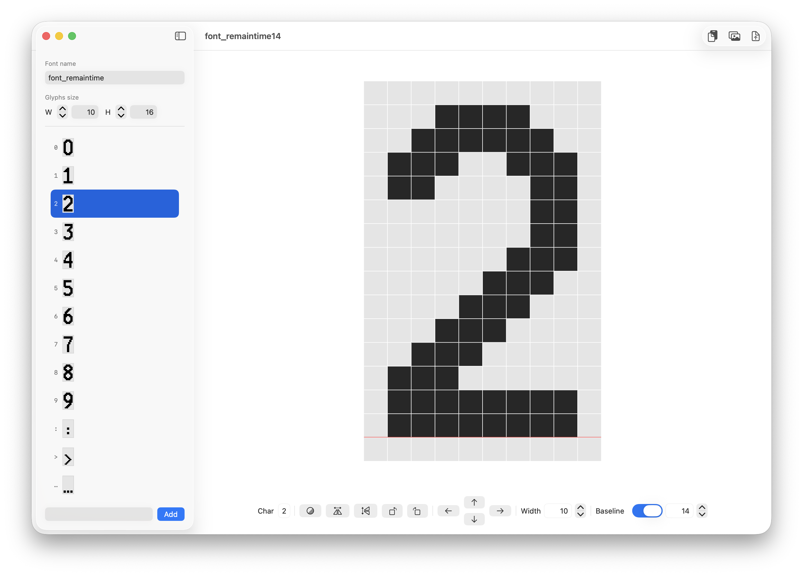

# PixelFont (SwiftUI)

A SwiftUI bitmap font editor for macOS. Create, modify, and export glyphs (Adafruit GFX, raw C, etc.). Perfect for Arduino projects with small displays (e-paper, OLED, etc.).

- 100% SwiftUI
- Image import (PNG/JPEG/TIFF/PDF) into a glyph
- Drawing tools (paint, erase with ⌘ while dragging, flips, rotations, nudges)
- Per-glyph effective width control (advance width offset)
- Per-glyph xOffset/yOffset with baseline-aware preview
- Overflow-safe pixel editing (canvas can expand/shrink beyond the visible frame)
- Adafruit GFX
- Full Undo/Redo support

## Screenshots

## Requirements

- macOS with Xcode 15 or later (tested on recent Xcode versions)

## Installation

1. Open `PixelFont.xcodeproj` in Xcode.
2. Build and run the macOS app.

## Usage

- Create or open a document.
- Adjust global glyph size from the sidebar.
- Adjust per-glyph advance width from the inspector (effective width).
- Use the expand/shrink controls to grow or reduce the glyph canvas outside the visible frame; the preview keeps the frame consistent.
- Toggle the baseline and adjust its position (y) to preview vertical alignment.
- Draw with click/drag; hold ⌘ while dragging to erase.
- Use the toolbar buttons for inversion, horizontal/vertical flips, 90° rotations, and pixel nudges.
- Import images via the “Import Image” button or “Paste and import”. Images are resized to the current glyph size with thresholding and optional margins.
- Export using the “Export” button (Adafruit GFX).

## File Format

Documents are serialized as JSON using .pixf extension.

## Glyph Metrics & Layout

Each glyph supports:
- Advance width (effective width = base width + per-glyph offset)
- xOffset/yOffset (frame origin within the full pixel matrix)
- Baseline-aware preview

Editing can safely overflow the original pixel matrix: the canvas can grow as you paint or via dedicated expand/shrink controls. The visible frame (what gets exported) stays consistent with advance/xOffset/yOffset so preview and export match.

## Export

- Adafruit GFX (`GFXfont`) via the Export panel. Export uses MSB-first packing, crops to the minimal bounding box (or frame), and computes xAdvance/xOffset/yOffset to match the in-app preview.

## Architecture Notes

- The model is centered around `FontDocument` and `Glyph`.
- `FontDocumentViewModel` coordinates editing operations with undo support.
- `GlyphCanvasView` renders and edits pixels with SwiftUI’s `Canvas`.
- Adafruit GFX export is generated from the current glyph set and dimensions, honoring advance width, xOffset/yOffset, and baseline for correct layout.

## Credits & Inspiration

This project was inspired by https://github.com/ayoy/fontedit, but has been fully reworked and implemented in SwiftUI.

## Roadmap (Ideas)

- More import controls (auto-trim, auto-baseline)
- Additional export targets
- Sample fonts and templates

## Contributing

Issues and pull requests are welcome. Please include screenshots and steps to reproduce for UI issues.

## License

MIT — see `LICENSE` for details.

## Badges

